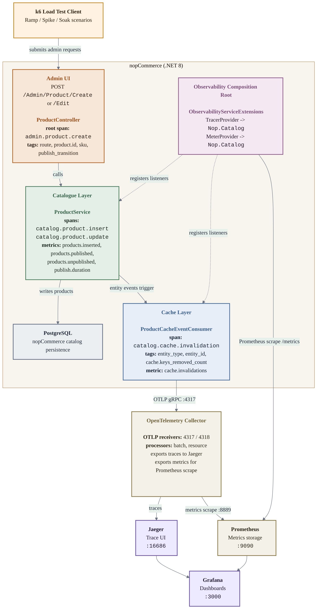
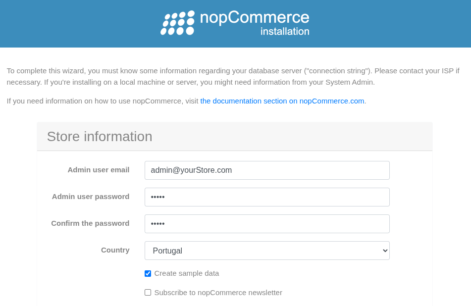
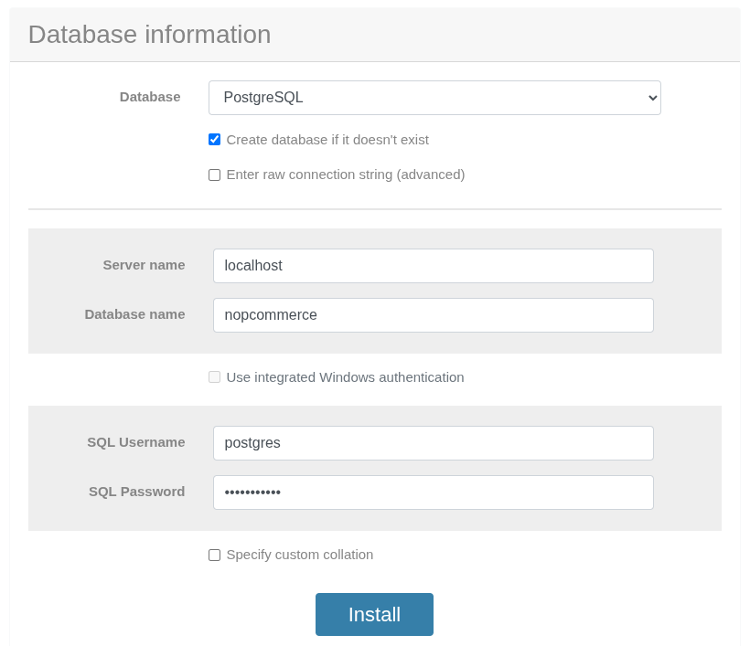
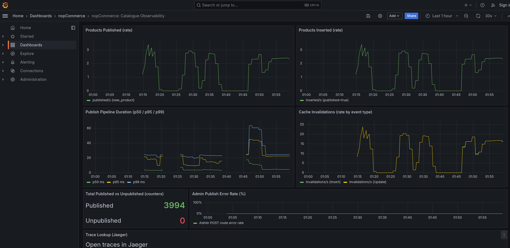
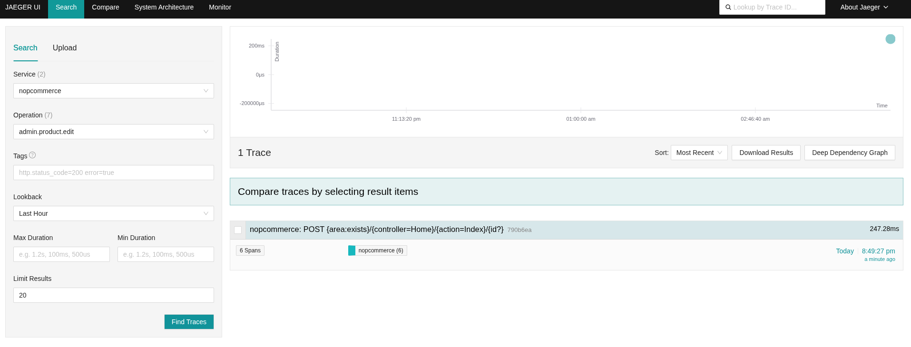
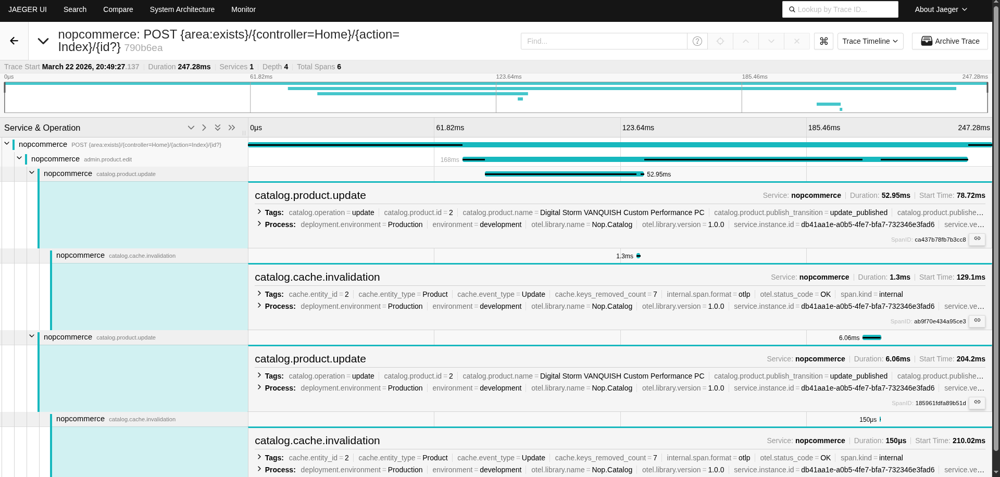
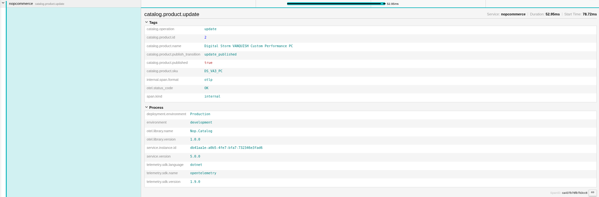
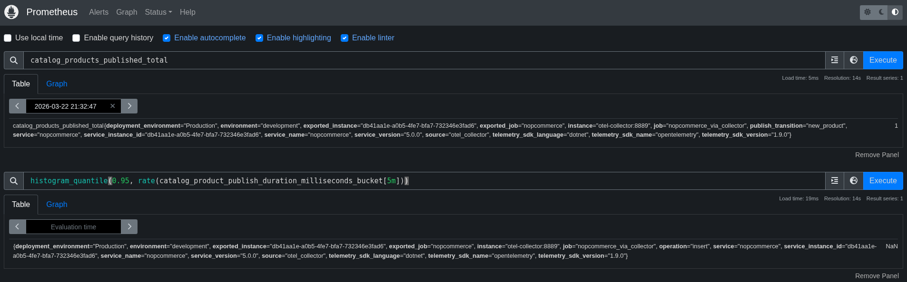
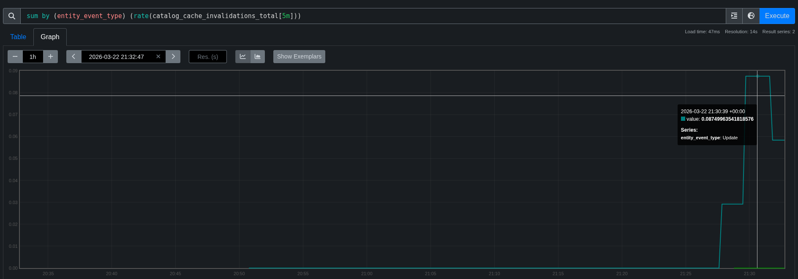

# nopCommerce: Observability with OpenTelemetry
## Assignment 1: Admin Publishes a New Product

> This file documents the observability work added on top of the [nopCommerce](https://github.com/nopSolutions/nopCommerce) fork.  

---

## Table of Contents

1. [Architecture Overview](#architecture-overview)
2. [Surgical Changes to nopCommerce](#surgical-changes-to-nopcommerce)
3. [Architectural Reading of nopCommerce](#architectural-reading-of-nopcommerce)
4. [Metric Design and Justification](#metric-design-and-justification)
5. [Prerequisites](#prerequisites)
6. [Build](#build)
7. [Run (with observability stack)](#run)
8. [Viewing the Dashboards](#viewing-the-dashboards)
9. [Load Test](#load-test)
10. [Instrumented User Flow](#instrumented-user-flow)

---

## Architecture Overview



Mermaid source for this diagram: [`pictures/architecture_overview.mmd`](./pictures/architecture_overview.mmd)

### Vendor-neutral instrumentation principle

```
Nop.Services  ──  System.Diagnostics only  ──  zero OTel SDK dependency
                  (ActivitySource / Meter: built into .NET runtime)
                           │
                           │  SDK listens at runtime
                           ▼
Nop.Web       ──  OTel SDK NuGet packages  ──  only at host/composition root
                  (registers listeners, configures exporters)
```

---

## Surgical Changes to nopCommerce

The observability work was intentionally kept surgical rather than spreading
OpenTelemetry concerns through the whole codebase. The main changes to existing
nopCommerce code were:

- `ProductController`:
  added root spans for `admin.product.create` and `admin.product.edit` so the
  traced flow starts at the admin HTTP boundary.
- `ProductService`:
  added domain spans and metrics around product insert/update so the business
  operation, not just the outer request, is observable.
- `ProductCacheEventConsumer`:
  added trace and metric emission for cache invalidation, exposing the main
  post-write side-effect of the publish flow.
- `IProductService` / `ProductService`:
  introduced a small overload that accepts `publishTransition`, avoiding an
  extra database query just to recover old publish state for telemetry.
- `Nop.Web` composition root:
  registered the OpenTelemetry SDK only in the host layer
  (`ObservabilityServiceExtensions`), keeping `Nop.Services` vendor-neutral and
  free from SDK package dependencies.

This was done to preserve the existing layered architecture as much as
possible: presentation concerns remain in `Nop.Web`, business meaning remains
in `Nop.Services`, and operational side-effects remain visible through the
existing event/cache mechanisms instead of a wider refactor.

---

## Architectural Reading of nopCommerce

This section answers the architectural questions from the assignment directly.
It is intentionally about the codebase structure and instrumentation trade-offs,
not just about how to run the demo.

### How the layers are organised

nopCommerce is organised in a fairly traditional layered architecture:

| Layer | Main responsibilities | Examples in this repository | Dependency rule |
|------|------|------|------|
| Presentation | HTTP endpoints, Razor views, admin/public controllers, DI composition root | `src/Presentation/Nop.Web`, `Areas/Admin/Controllers/ProductController.cs` | May depend on Services, Core, Data abstractions |
| Services | Business logic, orchestration, cache consumers, domain workflows | `src/Libraries/Nop.Services` | May depend on Core and Data abstractions, but should not depend on Presentation |
| Data | Repository implementation, EF/data provider plumbing, persistence concerns | `src/Libraries/Nop.Data` | Depends on Core abstractions and infrastructure contracts |
| Core | Domain entities, events, interfaces, settings, shared primitives | `src/Libraries/Nop.Core` | Lowest-level shared layer |

For this assignment, the important practical dependency rule is:

- `Nop.Web` is where HTTP concerns and SDK wiring belong.
- `Nop.Services` is where business meaning lives, so it is the best place to add domain spans and metrics.
- `Nop.Data` is where persistence and entity lifecycle events happen.
- `Nop.Core` defines the event contracts and shared entities that other layers react to.

That layering is one reason the chosen flow was workable: the controller calls
`IProductService`, the service writes through `IRepository<Product>`, and the
repository then triggers entity events that cache consumers observe.

### How nopCommerce handles events internally

The internal event model is in-process and synchronous around `IEventPublisher`.

At a high level, the chain for this flow is:

```
ProductController
  -> IProductService
     -> IRepository<Product>.InsertAsync / UpdateAsync
        -> IEventPublisher.EntityInsertedAsync / EntityUpdatedAsync
           -> EventPublisher.PublishAsync(...)
              -> all matching IConsumer<TEvent>
                 -> ProductCacheEventConsumer.HandleEventAsync(...)
```

The important code points are:

- `EntityRepository<TEntity>` persists the entity and then publishes `EntityInsertedEvent<T>` / `EntityUpdatedEvent<T>`.
- `EventPublisherExtensions` in `Nop.Core.Events` wraps that in typed helper methods such as `EntityInsertedAsync`.
- `EventPublisher` in `Nop.Services.Events` resolves all `IConsumer<TEvent>` implementations from the container and invokes them sequentially.
- `CacheEventConsumer<TEntity>` is a reusable base class that subscribes to insert/update/delete entity events and clears cache accordingly.
- `ProductCacheEventConsumer` is the concrete consumer for `Product`.

Architecturally, this matters because `IEventPublisher` is a natural
observability boundary: it marks the moment where a write in one part of the
system causes secondary effects elsewhere. I chose not to instrument the
publisher itself, because that would have created a more generic but noisier
signal. Instrumenting the concrete cache consumer gave a smaller, more
meaningful trace for the selected flow.

### Where the code makes observability easy

The codebase helped in a few important ways:

- The service layer already concentrates business operations behind interfaces such as `IProductService`, so one span can represent a meaningful unit of work.
- The repository layer publishes typed entity events automatically after persistence, which creates a clean hook for post-write observability.
- Cache invalidation is already centralized in `CacheEventConsumer<TEntity>` and `ProductCacheEventConsumer`, so the operational side-effect of a publish is observable without invasive refactoring.
- The composition root in `Nop.Web` makes it easy to keep OpenTelemetry SDK wiring in one place (`ObservabilityServiceExtensions`) instead of spreading exporter logic through the application.

### Where the code makes observability hard

The codebase also creates a few frictions:

- nopCommerce is a large monolith, so many meaningful workflows cross multiple services without explicit domain-level boundaries; this makes it easy to either under-instrument or produce too much noise.
- `IEventPublisher` is generic and container-driven, which is flexible but hides the event graph. You have to read both the publisher and the consumers to understand what really happens after a write.
- Some of the most important effects are indirect. For example, a publish does not explicitly call a cache invalidation service from `ProductService`; the effect appears later through entity events.
- The service layer contains rich domain objects, and in more sensitive flows that would increase the risk of accidentally attaching PII-heavy objects to telemetry.

### What would need to change structurally to instrument nopCommerce more deeply

To instrument nopCommerce more comprehensively, the following structural changes
would help:

| Possible structural change | Benefit | Cost / why it was not done here |
|------|------|------|
| Wrap `IEventPublisher` with domain-aware tracing | Would expose event fan-out explicitly in traces across many workflows | High noise risk; touches a cross-cutting infrastructure service |
| Replace static `ActivitySource` / `Meter` with DI-managed singletons | Better testability and cleaner lifecycle ownership | More refactoring for limited assignment value |
| Introduce explicit domain services for some side-effects | Clearer instrumentation boundaries than “follow repository events” | Larger architectural change than the assignment needs |
| Add integration tests for trace propagation and metric emission | Stronger confidence that observability survives changes | Useful, but extra scope beyond the chosen flow |

For this assignment, those changes were mostly **not worth making**. The goal
was to make a real codebase observable with minimal disruption, not to redesign
nopCommerce around observability. The most valuable surgical change was the
extra `UpdateProductAsync(product, publishTransition)` overload: it preserved
the existing architecture while letting the service span capture business
meaning without an extra database query.

---

## Metric Design and Justification

The assignment explicitly requires metrics that an operator could act on. The
chosen metrics were therefore selected as signals for throughput, degradation,
and side-effects of the publish pipeline.

| Metric | Why it exists | What an operator can infer / do |
|------|------|------|
| `catalog.products.published` | Measures business throughput, segmented by `publish_transition` | If this drops during a release or admin operation window, the operator knows publishes are not completing as expected even if the site is still up |
| `catalog.product.publish.duration` | Measures the latency of the business pipeline itself, not just the outer HTTP request | If p95 rises before failures appear, the operator can investigate DB or cache pressure before admins start reporting timeouts |
| `catalog.cache.invalidations` | Measures the operational effect triggered by each product write | If publishes succeed but invalidations drop unexpectedly, stale catalogue data or delayed storefront consistency becomes a likely issue |
| `catalog.products.inserted` | Separates pure product creation from later publish-state transitions | Helps distinguish “admins are creating drafts” from “admins are actually publishing products” |
| `catalog.products.unpublished` | Makes unpublish actions visible as their own operational event | A sudden rise can indicate admin mistakes, bulk edits, or unintended workflow behavior |

### Why these metrics are operationally useful

These metrics were chosen to answer concrete on-call style questions:

- Is the admin publish workflow still producing business outcomes, or are requests returning without actually making products visible?
- Is the workflow slowing down before it starts failing?
- Are secondary effects, especially cache invalidation, still happening after the write?
- Are admins creating products, publishing them, or unpublishing them unexpectedly?

In other words, the metrics are not just “easy counters”. They separate
business state transitions from technical side-effects, which is exactly what
lets the dashboard tell a story:

- throughput panel: are publishes happening?
- latency panel: is the pipeline degrading?
- cache invalidation panel: are side-effects still firing?
- trace panel: what did one concrete request do end-to-end?

---

## Prerequisites

| Tool | Version | Notes |
|------|---------|-------|
| .NET SDK | 9.0.200+ | `dotnet --version` |
| Docker | 24.0+ | For observability stack |
| Docker Compose | v2.x | `docker compose version` |
| k6 | 0.50+ | Load tests - `k6 version` |

Install k6: https://k6.io/docs/get-started/installation/

This repository is pinned via [`global.json`](./global.json) to SDK `9.0.100` with `rollForward: latestFeature`, so the recommended setup is the latest available `.NET 9` SDK (`9.0.200+` or newer in the 9.0 line). This is required for restoring `Humanizer 3.0.x`, which needs newer NuGet tooling than SDK `9.0.100`.

---

## Build

```bash
# Clone this fork
git clone https://github.com/luanacarolinareis/nopCommerceObservability
cd nopCommerceObservability

# Restore and build
dotnet restore src/NopCommerce.sln
dotnet build  src/NopCommerce.sln --configuration Release
```

---

## Run

### 1. Start the observability stack

```bash
docker compose -f observability-stack.yml up -d
```

> Note: to force clean restart -> docker compose -f observability-stack.yml up -d --force-recreate prometheus grafana

This starts:
- OpenTelemetry Collector (OTLP gRPC `:4317`, HTTP `:4318`)
- Jaeger (UI at http://localhost:16686)
- Prometheus (UI at http://localhost:9090)
- Grafana (UI at http://localhost:3000, anonymous admin)

### 2. Configure the OTLP endpoint

The application reads the collector endpoint from configuration.  
Add to `src/Presentation/Nop.Web/App_Data/appsettings.json` (create if absent):

```json
{
  "Observability": {
    "OtlpEndpoint": "http://localhost:4317",
    "ConsoleExporterEnabled": false
  }
}
```

For local development with console output (no Collector needed):
```json
{
  "Observability": {
    "OtlpEndpoint": "http://localhost:4317",
    "ConsoleExporterEnabled": true
  }
}
```

### 3. Start nopCommerce

Before starting the web application, start a PostgreSQL database container for it to use:
```bash
docker run -d --name nopcommerce_pg -p 5432:5432 -e POSTGRES_USER=postgres -e POSTGRES_PASSWORD=db_password -e POSTGRES_DB=nopcommerce postgres:latest
```

Wait a few seconds for the database to initialize, then create the `citext` extension which nopCommerce requires to run database migrations successfully:
```bash
docker exec -it nopcommerce_pg psql -U postgres -d nopcommerce -c "CREATE EXTENSION IF NOT EXISTS citext;"
```

> Note: if db container was already created, just do "docker start nopcommerce_pg"

Then, run nopCommerce:
```bash
cd src/Presentation/Nop.Web
dotnet run --configuration Release
```

The app starts at http://localhost:5000.  
Complete the installation wizard on first run. For a quick setup, follow these steps:

**1. Store information (Admin Data):**
*   **Admin user email:** Enter the email you will use to log in (e.g., `admin@yourStore.com`).
*   **Admin user password:** Create a secure password and confirm it.
*   **Country:** Select your country.
*   **Create sample data:** It is recommended to check this box so the store is pre-filled with test products.
*   **Subscribe to nopCommerce newsletter:** Optional. Leave unchecked if you do not wish to receive emails from nopCommerce.



**2. Database information:**
*   **Database:** Click the dropdown and change it to **"PostgreSQL"**.
*   **Create database if it doesn't exist:** Check this box.
*   **Enter raw connection string (advanced):** Leave unchecked. We will let nopCommerce build the connection string using the individual fields below.
*   **Server name:** `localhost`
*   **Database name:** `nopcommerce`
*   **Use integrated Windows authentication:** Leave unchecked. This is only applicable for Microsoft SQL Server running on Windows environments.
*   **SQL username:** `postgres`
*   **SQL password:** `db_password` (or whatever password you set in the docker command)
*   **Specify custom collation:** Leave unchecked. PostgreSQL default collation is usually fine for a standard setup and prevents locale-specific sorting issues.



**3. Install:**
*   Click the blue **Install** button. Avoid clicking more than once and wait for the process to complete (it may take a minute or two).
*   **Note:** After the installation and migrations finish, nopCommerce might require a restart. If the page completely stops responding or fails to load, go back to your terminal, stop the running process (`Ctrl+C`), and start it again with `dotnet run --configuration Release`.


### 4. Verify telemetry is flowing

```bash
# Should return Prometheus text format metrics
curl http://localhost:5000/metrics | grep catalog_
```

If you see an empty output but the command runs successfully (as shown below), it means the `/metrics` endpoint is working and properly set up, but no catalogue-related actions (like inserting or publishing a product) have been performed yet to trigger the `catalog_` metrics generation:

```bash
  % Total    % Received % Xferd  Average Speed  Time    Time    Time   Current
                                 Dload  Upload  Total   Spent   Left   Speed
100  22689   0  22689   0      0 272.4k      0 --:--:-- --:--:-- --:--:--  276k
```

*(Once you publish or create a product in the admin UI or run the load test, rerunning this command will display the custom metrics).*

---

## Viewing the Dashboards

### Grafana - nopCommerce Catalogue Dashboard


1. Open http://localhost:3000
2. Navigate to **Dashboards → nopCommerce → nopCommerce: Catalogue Observability**
3. The dashboard auto-provisions on startup - no manual import needed.

The application defines its instruments with .NET `Meter` names such as `catalog.products.published` and `catalog.product.publish.duration`.
When exposed to Prometheus, those names are normalized as follows:
- dots become underscores
- counters gain the `_total` suffix
- histogram units are expanded into Prometheus-style series such as `_milliseconds_bucket`, `_milliseconds_sum`, and `_milliseconds_count`

Examples:
- `catalog.products.published` -> `catalog_products_published_total`
- `catalog.products.inserted` -> `catalog_products_inserted_total`
- `catalog.product.publish.duration` -> `catalog_product_publish_duration_milliseconds_bucket`

Panels:
| Panel | Query |
|-------|-------|
| Products Published (rate) | `sum(rate(catalog_products_published_total[5m]))` |
| Products Inserted (rate) | `sum(rate(catalog_products_inserted_total[5m]))` |
| Publish Pipeline Duration (p50 / p95 / p99) | `histogram_quantile()` over `sum by (le) (rate(catalog_product_publish_duration_milliseconds_bucket[5m]))` |
| Cache Invalidations (rate by event type) | `sum by (entity_event_type) (rate(catalog_cache_invalidations_total[5m]))` |
| Total Published vs Unpublished (counters) | `sum(catalog_products_published_total)` and `sum(catalog_products_unpublished_total)` |
| Admin Publish Error Rate (%) | `100 * failed_requests / total_requests` for `http_route="/Admin/Product/Create"` using Prometheus HTTP server metrics |
| Trace Explorer (Jaeger) | Jaeger datasource, operation `admin.product.create` |

Failure visibility:
- The dashboard now includes a dedicated **Admin Publish Error Rate (%)** panel for the chosen flow.
- It is computed from the ASP.NET Core HTTP server metrics exported through OpenTelemetry and filtered to `http_route="/Admin/Product/Create"`.
- The panel treats `4xx` and `5xx` responses on that route as failed publish requests and shows the percentage over the last 5 minutes.

### Jaeger - Distributed Traces

1. Open http://localhost:16686
2. Select **Service: nopcommerce**
3. Select **Operation: admin.product.edit** (or `admin.product.create`)

> **Note:** The `admin.product.edit` operation will only appear in the dropdown **after** you edit at least one product in the NopCommerce admin panel or run the load test. Until then, you will only see generic GET/POST operations.

4. Click **Find Traces**

#### Understanding the Jaeger Search Fields



*   **Service:** The name of the application sending traces. We configured ours to act as `nopcommerce`.
*   **Operation:** The specific action you want to investigate (e.g., `admin.product.edit` for when a product is edited).
*   **Tags:** Allows filtering traces by specific metadata. Format must be `key=value`. 
    *   *Example:* If you want to find traces where a product was published, you can use `catalog.product.published=true`. 
    *   *Note:* Use spaces for multiple conditions (AND) and enclose values with spaces/equals signs in quotes (e.g., `db.statement="select * from User"`).
*   **Lookback:** Defines the time range to search backward from right now (e.g., last 1 hour).
*   **Max Duration / Min Duration:** Filter traces out based on how long they took to execute. Highly useful to find slow queries or bottlenecks (e.g., Min Duration = `500ms`).
*   **Limit Results:** The maximum number of traces to display on the screen at once.

Each trace shows the full span tree:
```
admin.product.edit  (root, ActivityKind.Server)
  └─ catalog.product.update
       └─ catalog.cache.invalidation
```

#### Understanding the Jaeger Trace Results



A **trace** in Jaeger represents the full journey of a request as it flows through the system. Each trace is composed of one or more **spans**.

- **Span:** A span represents a single operation or step in the request's lifecycle (e.g., a controller action, a service method, a database call). Each span has a name, a start and end time, and can include tags, logs, and references to other spans.
- **Root Span:** The first span in a trace, representing the entry point of the request (e.g., `admin.product.edit`).
- **Child Spans:** Spans that are triggered as part of the root operation, such as service calls or cache invalidations (e.g., `catalog.product.update`, `catalog.cache.invalidation`).

Spans are organized in a tree structure, showing the parent-child relationships and the order in which operations occurred. This helps you:
* Visualize the flow of a request end-to-end
* Identify which parts of the process are slow or failing
* See how much time is spent in each layer (web, service, database, cache, etc.)

In the example below, you can see how editing a product triggers a service update and a cache invalidation, each represented as a span:

```
admin.product.edit  (root, ActivityKind.Server)
  └─ catalog.product.update
       └─ catalog.cache.invalidation
```

You can click on each span in Jaeger to see its details, including timing, tags, and logs, to better understand the behavior and performance of your application.



### Prometheus

1. Open http://localhost:9090
2. Use these queries to validate the instrumentation:

| What you want to inspect | Query | Interpretation |
|---|---|---|
| Total number of publish events | `catalog_products_published_total` | Raw cumulative counter. After manually publishing one new product, seeing a series at `1` is expected. |
| Total publishes across all labels | `sum(catalog_products_published_total)` | Easier dashboard/summary view when you do not care about label breakdowns. |
| Publish rate in the last 5 minutes | `sum(rate(catalog_products_published_total[5m]))` | Throughput, not total volume. Useful during load tests; may be `0` when idle. |
| Total inserts | `catalog_products_inserted_total` | Raw cumulative counter for product creation operations. |
| Insert rate in the last 5 minutes | `sum(rate(catalog_products_inserted_total[5m]))` | Shows how fast new products are being created. |
| Cache invalidation rate by event type | `sum by (entity_event_type) (rate(catalog_cache_invalidations_total[5m]))` | Shows whether inserts/updates are triggering cache clears. |
| Histogram buckets for publish duration | `catalog_product_publish_duration_milliseconds_bucket` | Confirms the histogram exists and buckets are being exported. |
| Histogram sample count | `catalog_product_publish_duration_milliseconds_count` | Number of publish duration measurements recorded. |
| Histogram sample sum | `catalog_product_publish_duration_milliseconds_sum` | Sum of all recorded publish durations in milliseconds. |
| Average publish duration | `sum(rate(catalog_product_publish_duration_milliseconds_sum[5m])) / sum(rate(catalog_product_publish_duration_milliseconds_count[5m]))` | Mean latency over the last 5 minutes. |
| p50 publish duration | `histogram_quantile(0.50, sum by (le) (rate(catalog_product_publish_duration_milliseconds_bucket[5m])))` | Median publish latency. |
| p95 publish duration | `histogram_quantile(0.95, sum by (le) (rate(catalog_product_publish_duration_milliseconds_bucket[5m])))` | Tail latency. Better than average for spotting slow publishes. |
| p99 publish duration | `histogram_quantile(0.99, sum by (le) (rate(catalog_product_publish_duration_milliseconds_bucket[5m])))` | Extreme tail latency for heavier tests. |

3. If you want to keep the histogram split by operation label, include it in the aggregation:

```promql
histogram_quantile(
  0.95,
  sum by (le, operation) (
    rate(catalog_product_publish_duration_milliseconds_bucket[5m])
  )
)
```

4. If Prometheus shows `NaN` for a histogram quantile, that usually does not mean the metric is broken. It usually means one of these:
- there are not enough samples in the selected time window
- the selected window is too short for a manual test
- the query did not aggregate buckets by `le`

5. A good troubleshooting order is:
- check `catalog_product_publish_duration_milliseconds_bucket`
- check `catalog_product_publish_duration_milliseconds_count`
- check `catalog_product_publish_duration_milliseconds_sum`
- only then calculate `histogram_quantile(...)`

6. For manual testing, prefer switching the Prometheus graph range to the last `15m` or `1h` after publishing a single product. With only one or two events, short-window `rate(...)` queries can legitimately return `0` or `NaN`.





---

## Load Test

See [`load-test/README.md`](load-test/README.md) for full instructions.

Quick start:
```bash
# Against local instance
k6 run load-test/publish-product.js

# With custom target
k6 run --env BASE_URL=http://localhost:5000 load-test/publish-product.js

# Higher load (10 VUs for 2 minutes)
k6 run --env BASE_URL=http://localhost:5000 \
       --vus 10 --duration 2m \
       load-test/publish-product.js
```

### Example interpretation of a successful load test

In one successful local run of the default ramp scenario, the following results were observed:

- `published_products_total = 717`
- `publish_failure_rate = 0.00%`
- `publish_e2e_duration_ms p(95) = 538ms`
- `http_req_duration p(95) = 154.25ms`
- `http_req_failed = 0.00%`

This means:
- the test created and published 717 products successfully
- the publish workflow remained stable throughout the run
- there were no HTTP transport failures
- end-to-end publish latency stayed comfortably below the configured threshold of `3s`
- individual HTTP requests also stayed responsive under load

After running k6, the observability stack should show the same workload from three perspectives:
- Prometheus should show strong growth in `catalog_products_published_total` and non-empty histogram data for publish duration.
- Grafana should show visible spikes in publish throughput and publish-duration panels during the test window.
- Jaeger should show many `admin.product.create` traces with child spans such as `catalog.product.insert` and `catalog.cache.invalidation`.

### Comparing ramp, spike, and soak results

The three k6 scenarios provide complementary views of system behavior:

#### Ramp scenario

- `published_products_total = 717`
- `publish_failure_rate = 0.00%`
- `publish_e2e_duration_ms p(95) = 538ms`
- `http_req_duration p(95) = 154.25ms`
- `http_req_failed = 0.00%`

Interpretation:
- the system handled gradually increasing load without failures
- publish latency remained low and stable
- this is a good baseline for normal operating conditions

#### Spike scenario

- `published_products_total = 574`
- `publish_failure_rate = 0.00%`
- `publish_e2e_duration_ms p(95) = 2.09s`
- `http_req_duration p(95) = 738.17ms`
- `http_req_failed = 0.00%`

Interpretation:
- the sudden burst to 30 VUs increased latency significantly compared with the ramp run
- however, the system still stayed within all defined thresholds
- there were no functional publish failures and no HTTP transport failures
- this indicates controlled degradation under burst traffic rather than instability

#### Soak scenario

- `published_products_total = 1573`
- `publish_failure_rate = 0.00%`
- `publish_e2e_duration_ms p(95) = 466ms`
- `http_req_duration p(95) = 185.85ms`
- `http_req_failed = 0.00%`

Interpretation:
- the system remained stable during sustained load over 10 minutes
- latency stayed consistently low throughout the run
- there were no signs of progressive degradation, instability, or leak-like behavior in the observed metrics

#### Overall conclusion

- `ramp` showed stable behavior under gradually increasing load
- `spike` showed the worst latency, as expected, but still passed all thresholds
- `soak` showed strong long-running stability with low latency and zero failures

Together, these results indicate that the instrumented nopCommerce publish workflow is resilient under normal load, sudden bursts, and sustained moderate traffic.

---

## Instrumented User Flow

To see the telemetry generated in action, you can manually reproduce the instrumented operations from your browser:

### How to trigger a trace (Create/Edit a Product)
*   **Create a new product:** Navigate directly to http://localhost:5000/Admin/Product/Create or click **Catalog → Products → Add new** inside the admin panel. Fill in the basic details (like name) and click **Save**.
*   **Edit an existing product:** Go to http://localhost:5000/Admin/Product/List, click **Edit** on any of the sample products, make a change, and hit **Save**.

The full end-to-end trace for **Admin Publishes a New Product** will look like this:

```
[Browser] POST /Admin/Product/Create
    │
    ├─ [admin.product.create]  ← root span, ActivityKind.Server
    │    catalog.product.published_submitted = true
    │    catalog.product.id = 42   (set after DB insert)
    │    catalog.product.sku = "WH-001"
    │
    └─ [catalog.product.insert]  ← child span, Nop.Services layer
         catalog.product.id = 42
         catalog.product.published = true
         catalog.product.publish_transition = "new_product"
         ──► metric: catalog.products.inserted{product.published="True"} +1
         ──► metric: catalog.products.published{publish_transition="new_product"} +1
         ──► metric: catalog.product.publish.duration{operation="insert"} = 14ms
         │
         └─ [catalog.cache.invalidation]  ← triggered by EF Core entity event
              cache.entity_type = "Product"
              cache.entity_id = 42
              cache.event_type = "Insert"
              cache.keys_removed_count = 9
              ──► metric: catalog.cache.invalidations{entity_event_type="Insert"} +9
```

For the **Edit → First Publish** flow (product was draft, now published):

```
[Browser] POST /Admin/Product/Edit
    └─ [admin.product.edit]
         catalog.product.publish_transition = "first_publish"
         └─ [catalog.product.update]
              catalog.product.publish_transition = "first_publish"
              ──► metric: catalog.products.published{publish_transition="first_publish"} +1
              ──► metric: catalog.product.publish.duration{operation="first_publish"} = 11ms
```

### How to interpret the expected metrics after one manual publish

If you create one brand new product in the admin UI and save it as published, the most common expected observations are:

- `catalog_products_inserted_total` increases by `1`
- `catalog_products_published_total{publish_transition="new_product"}` increases by `1`
- `catalog_product_publish_duration_milliseconds_count` increases by `1`
- `catalog_product_publish_duration_milliseconds_sum` increases by roughly the publish latency in milliseconds
- one or more `catalog_product_publish_duration_milliseconds_bucket` series increase depending on which latency bucket captured the event

What is normal in Prometheus after only one manual action:
- a raw counter showing `1`
- a graph line staying flat at `1` because counters are cumulative
- a `rate(...[5m])` query returning a very small value or `0` once the event is no longer recent
- a `histogram_quantile(...)` query returning `NaN` if there are too few samples or the query is missing `sum by (le)`

What would be suspicious:
- `catalog_products_published_total` never increases after a successful publish
- histogram `_count`, `_sum`, and `_bucket` series are all absent after several publish operations
- cache invalidation counters never change when products are inserted or updated
